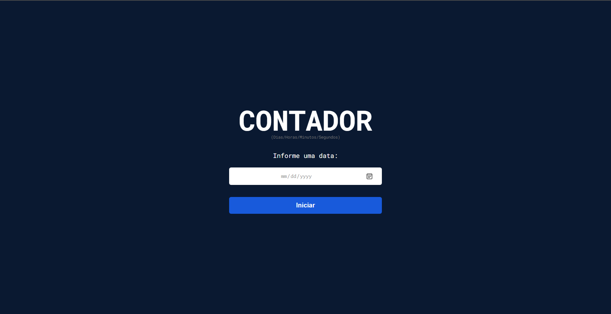
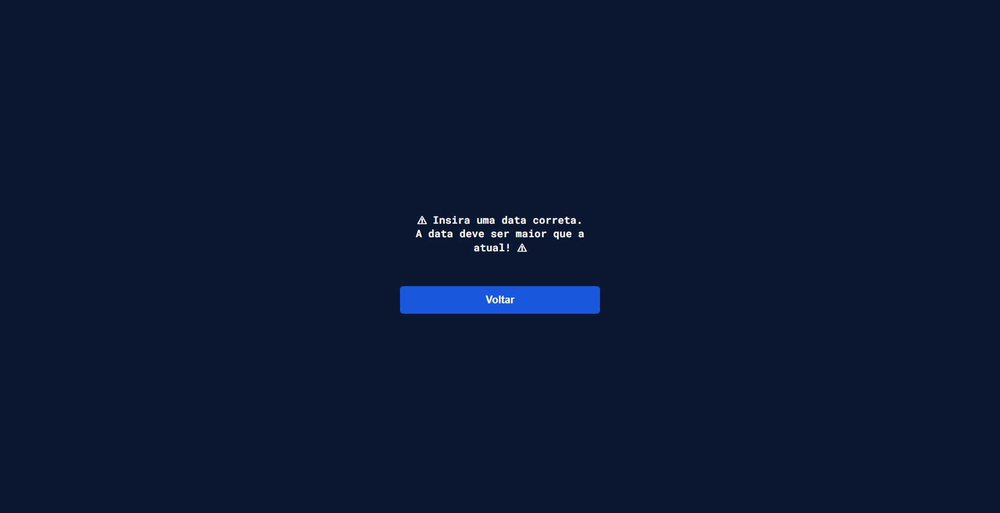
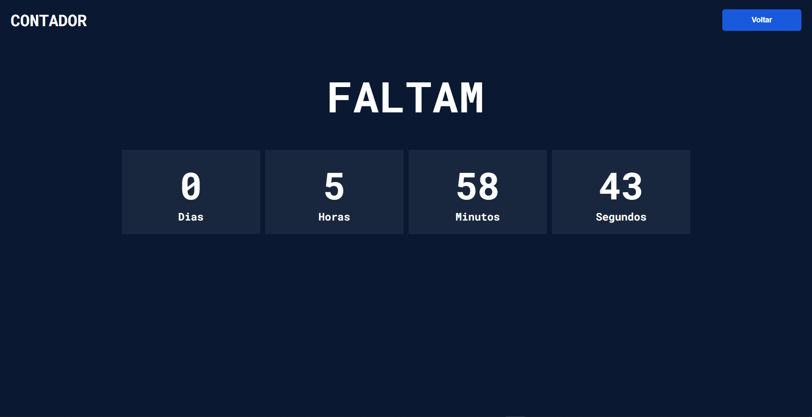
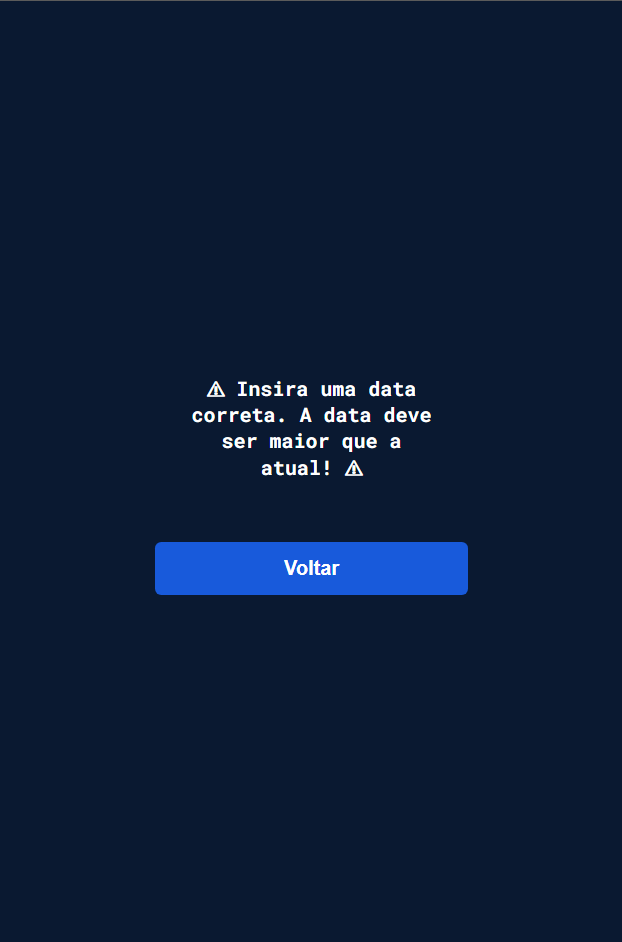
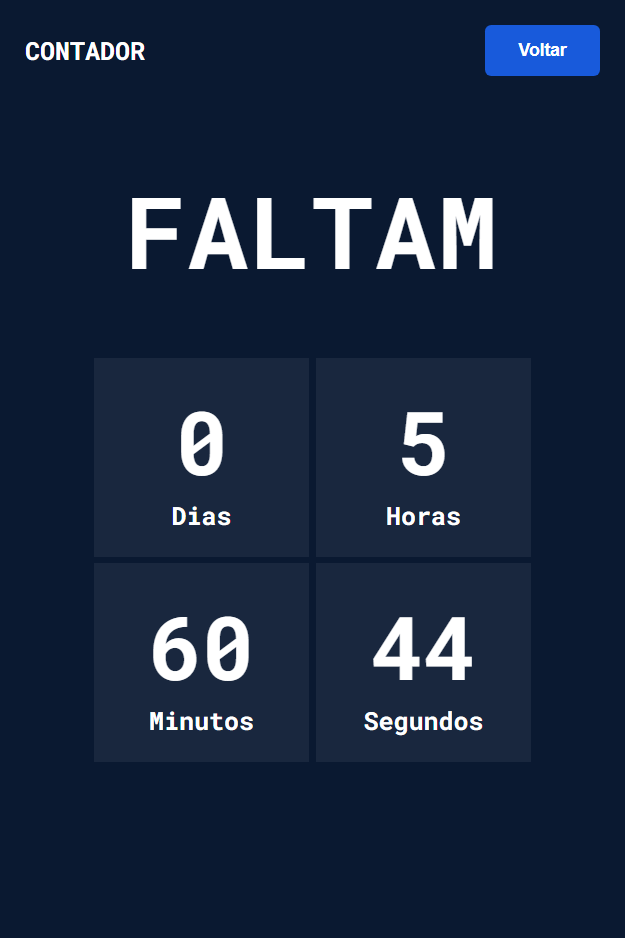

# contador-dev-challenges
 Desafio da [Dev Challenge](https://github.com/devchallenge-io), de criar um contador de dias, horas, minutos e segundos, baseado numa data passada como valor.

## Tecnologias usadas:
 - HTML
 - CSS
 - JavaScript Vanilla

Preferi modificar um pouco o layout proposto no desafio, mas deixando bem simples e agradável.  
Abaixo algumas imagens da minha versão do contador, tanto para navegador em desktop, quanto para mobile.

 
 
 
 

 
 
 
 

